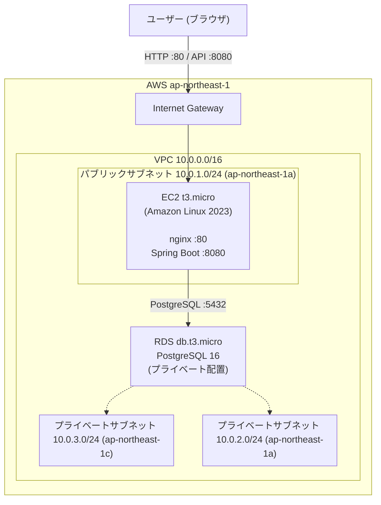
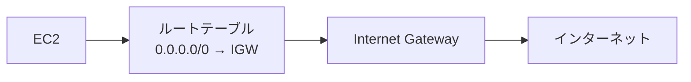
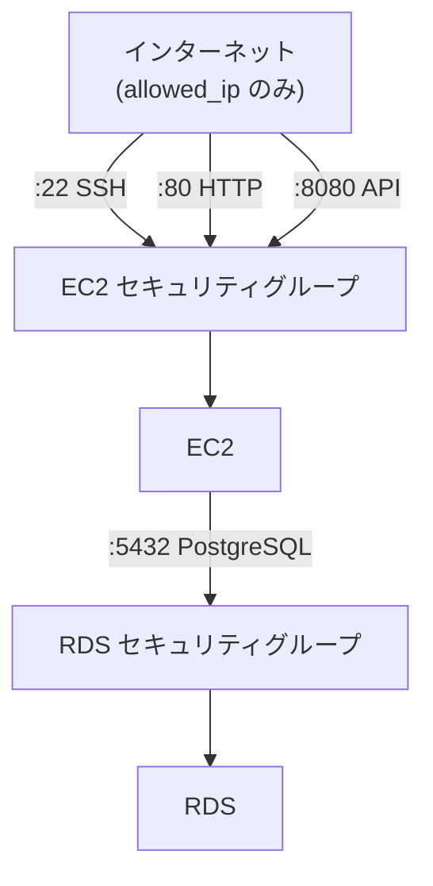
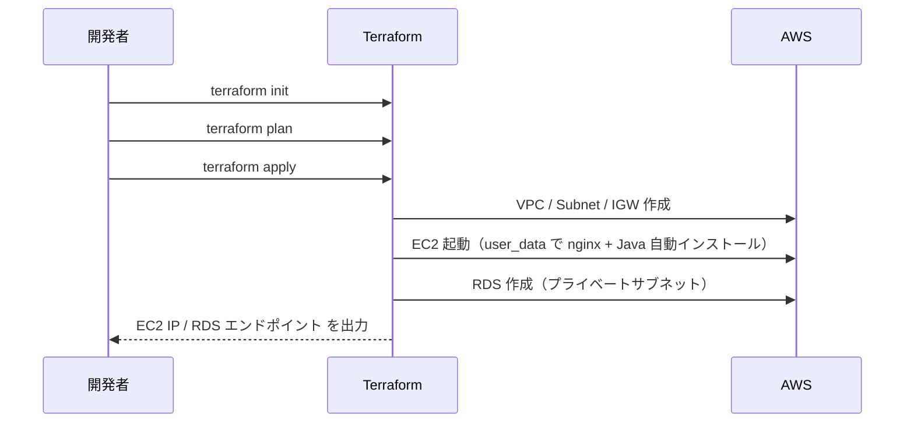
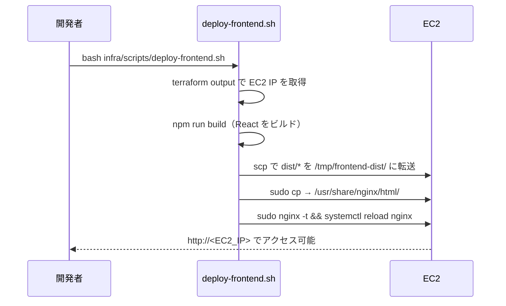
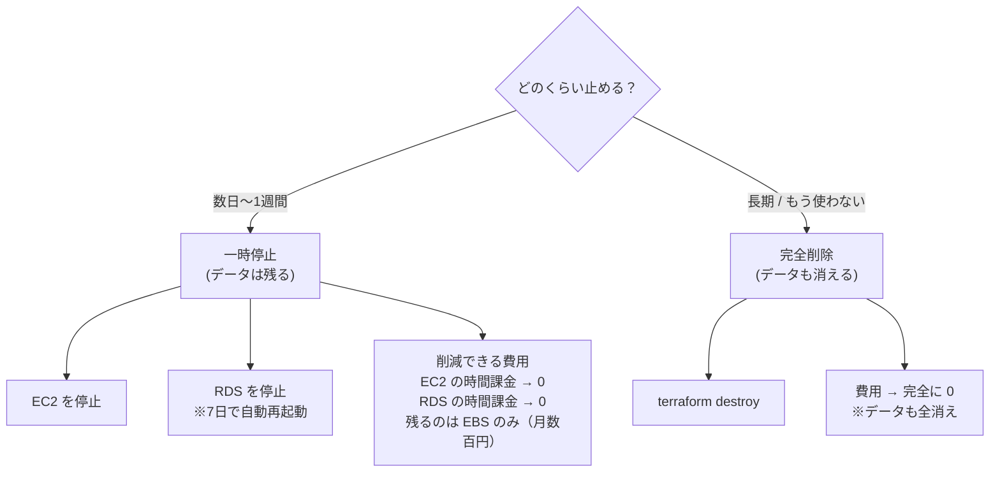

# AWS インフラ構成ドキュメント

TaskManagement アプリの AWS インフラをまとめたドキュメント。  
Terraform で管理し、リージョンは `ap-northeast-1`（東京）を使用。

---

## 目次

- [全体構成図](#全体構成図)
- [ネットワーク構成](#ネットワーク構成)
- [各サービスの詳細](#各サービスの詳細)
- [セキュリティグループ](#セキュリティグループ)
- [デプロイフロー](#デプロイフロー)
- [Terraform 操作手順](#terraform-操作手順)
- [コスト概算](#コスト概算)
- [費用を止める方法](#費用を止める方法)

---

## 全体構成図



---

## ネットワーク構成

### VPC・サブネット

| リソース | CIDR / AZ | 用途 |
|---|---|---|
| VPC | `10.0.0.0/16` | 全リソースを格納する仮想ネットワーク |
| パブリックサブネット | `10.0.1.0/24` / 1a | EC2（インターネット公開） |
| プライベートサブネット A | `10.0.2.0/24` / 1a | RDS（外部非公開） |
| プライベートサブネット C | `10.0.3.0/24` / 1c | RDS サブネットグループ要件（最低2AZ） |

### ルーティング



RDS が置かれるプライベートサブネットにはデフォルトルートがなく、インターネットから直接アクセス不可。

---

## 各サービスの詳細

### EC2（フロントエンド + バックエンド）

| 項目 | 値 |
|---|---|
| インスタンスタイプ | `t3.micro`（無料枠対象） |
| OS | Amazon Linux 2023 |
| ストレージ | gp3 / 20 GB |
| パブリック IP | あり（起動のたびに変わる）|

**EC2 上で動くプロセス:**

```
:80   nginx ── React ビルド済み静的ファイルを配信
                /api/* のリクエストは localhost:8080 へリバースプロキシ
:8080 Spring Boot ── REST API サーバー
```

nginx 設定のポイント（`/etc/nginx/conf.d/app.conf`）:
- `location /` → `try_files $uri /index.html` で React Router の SPA ルーティングに対応
- `location /api/` → `proxy_pass http://localhost:8080` でバックエンドへ転送

---

### RDS（データベース）

| 項目 | 値 |
|---|---|
| エンジン | PostgreSQL 16 |
| インスタンスクラス | `db.t3.micro` |
| ストレージ | gp2 / 20 GB |
| パブリックアクセス | 無効（EC2 からのみ接続可） |
| デフォルト DB 名 | `taskmanagement` |
| デフォルトユーザー | `postgres` |

RDS はプライベートサブネットに配置し、EC2 のセキュリティグループからのみポート 5432 を許可している。

---

## セキュリティグループ



| SG | インバウンド | 送信元 |
|---|---|---|
| EC2 SG | TCP 22（SSH） | `allowed_ip`（自分のIPのみ） |
| EC2 SG | TCP 80（HTTP） | `allowed_ip` |
| EC2 SG | TCP 8080（API） | `allowed_ip` |
| RDS SG | TCP 5432（PostgreSQL） | EC2 SG のみ |

> `allowed_ip` は `terraform.tfvars` で指定する。`curl https://checkip.amazonaws.com` で自分の IP を確認できる。

---

## デプロイフロー

### 初回セットアップ



### フロントエンドのデプロイ



**実行コマンド:**

```bash
# デフォルトキーパス: ~/.ssh/taskmanagement.pem
bash infra/scripts/deploy-frontend.sh

# キーパスを指定する場合
KEY_PATH=~/.ssh/my-key.pem bash infra/scripts/deploy-frontend.sh
```

### バックエンドのデプロイ（手動）

現時点では手動でデプロイする。

```bash
# ローカルでビルド
cd backend
./gradlew bootJar

# EC2 に転送
EC2_IP=$(terraform -chdir=infra/terraform output -raw ec2_public_ip)
scp -i ~/.ssh/taskmanagement.pem \
    build/libs/backend-*.jar \
    ec2-user@$EC2_IP:/home/ec2-user/app.jar

# EC2 上で起動
ssh -i ~/.ssh/taskmanagement.pem ec2-user@$EC2_IP
java -jar app.jar \
  --spring.datasource.url=jdbc:postgresql://<RDSエンドポイント>:5432/taskmanagement \
  --spring.datasource.username=postgres \
  --spring.datasource.password=<パスワード>
```

---

## Terraform 操作手順

### 前提

```bash
# terraform.tfvars を作成（git 管理外）
cp infra/terraform/terraform.tfvars.example infra/terraform/terraform.tfvars
# key_pair_name / allowed_ip / db_password を設定
```

### よく使うコマンド

```bash
cd infra/terraform

# 初期化（初回のみ）
terraform init

# 差分確認
terraform plan

# 適用
terraform apply

# 出力値を確認
terraform output

# EC2 の IP だけ取得
terraform output -raw ec2_public_ip

# リソース削除（注意: RDS も消える）
terraform destroy
```

### Outputs

| キー | 内容 |
|---|---|
| `ec2_public_ip` | EC2 のパブリック IP |
| `frontend_url` | `http://<EC2_IP>`（フロントエンド） |
| `backend_url` | `http://<EC2_IP>:8080`（バックエンド API） |
| `ssh_command` | SSH 接続コマンド |
| `rds_endpoint` | RDS エンドポイント（EC2 内からのみ到達可） |
| `rds_db_name` | DB 名 |

---

## コスト概算

新規 AWS アカウントの無料枠（12ヶ月間）内での構成。

| サービス | インスタンス | 無料枠 | 超過時の目安 |
|---|---|---|---|
| EC2 | t3.micro | 750 時間/月 | 約 $0.0136/時間 |
| RDS | db.t3.micro | 750 時間/月 | 約 $0.022/時間 |
| EBS（EC2用） | gp3 20 GB | 30 GB/月 | 約 $0.096/GB/月 |
| EBS（RDS用） | gp2 20 GB | 20 GB/月 | 約 $0.115/GB/月 |
| データ転送 | アウトバウンド | 1 GB/月 | 約 $0.114/GB |

> 無料枠終了後、24時間稼働させると EC2 + RDS だけで **月 $30〜40 程度**かかる。  
> 開発中は `terraform destroy` で削除しておくことを推奨。

---

## 費用を止める方法

「しばらく触らない」「今日は開発しない」という状況に応じて、2つの選択肢がある。



---

### 一時停止（データを残したまま費用を下げる）

EC2 と RDS をコンソールまたは CLI で「停止」すると、**時間課金がゼロ**になる。  
EBS ストレージ（EC2 の 20 GB + RDS の 20 GB）の費用だけが残る（合計で月 **約 $4〜5**）。

#### EC2 を停止・再開する

```bash
EC2_ID=$(aws ec2 describe-instances \
  --filters "Name=tag:Name,Values=taskmanagement-server" \
  --query "Reservations[0].Instances[0].InstanceId" \
  --output text \
  --region ap-northeast-1)

# 停止
aws ec2 stop-instances --instance-ids $EC2_ID --region ap-northeast-1

# 再開（IP アドレスが変わることに注意）
aws ec2 start-instances --instance-ids $EC2_ID --region ap-northeast-1

# 現在の状態を確認
aws ec2 describe-instances \
  --instance-ids $EC2_ID \
  --query "Reservations[0].Instances[0].State.Name" \
  --output text \
  --region ap-northeast-1
```

> **注意:** EC2 を再開すると**パブリック IP が変わる**。  
> `terraform output -raw ec2_public_ip` では古い IP が返るため、コンソールまたは以下で再取得する。
> ```bash
> aws ec2 describe-instances \
>   --instance-ids $EC2_ID \
>   --query "Reservations[0].Instances[0].PublicIpAddress" \
>   --output text --region ap-northeast-1
> ```

#### RDS を停止・再開する

```bash
DB_ID="taskmanagement-db"

# 停止（最大 7 日間。その後 AWS が自動的に再起動する）
aws rds stop-db-instance --db-instance-identifier $DB_ID --region ap-northeast-1

# 再開
aws rds start-db-instance --db-instance-identifier $DB_ID --region ap-northeast-1

# 状態確認（available / stopping / stopped）
aws rds describe-db-instances \
  --db-instance-identifier $DB_ID \
  --query "DBInstances[0].DBInstanceStatus" \
  --output text --region ap-northeast-1
```

> **RDS の 7 日制限について:**  
> AWS の仕様により、RDS の停止は最長 7 日間しか維持できない。  
> 7 日を過ぎると自動的に再起動され、課金が再開する。  
> 長期間使わない場合は後述の「完全削除」を選ぶこと。

#### 停止・再開のまとめ

| | EC2 停止中 | RDS 停止中 |
|---|---|---|
| 時間課金 | なし | なし |
| ストレージ課金 | あり（gp3 20GB） | あり（gp2 20GB） |
| データ | 保持される | 保持される |
| 再開後の IP | **変わる** | 変わらない |
| 最大停止期間 | 無制限 | **7 日** |

---

### 完全削除（費用をゼロにする）

長期間使わない場合や、環境を作り直したい場合は `terraform destroy` で全リソースを削除する。  
Terraform で管理しているため、**再構築は `terraform apply` 1コマンドで可能**。

#### 削除前にデータをバックアップする

```bash
# RDS のスナップショットを手動で作成（削除前に必ず実行）
aws rds create-db-snapshot \
  --db-instance-identifier taskmanagement-db \
  --db-snapshot-identifier taskmanagement-db-backup-$(date +%Y%m%d) \
  --region ap-northeast-1

# スナップショット作成完了まで待機（数分かかる）
aws rds describe-db-snapshots \
  --db-snapshot-identifier taskmanagement-db-backup-$(date +%Y%m%d) \
  --query "DBSnapshots[0].Status" \
  --output text --region ap-northeast-1
# → "available" になったら削除へ進む
```

#### terraform destroy で全削除

```bash
cd infra/terraform

# 削除対象を確認（実際にはまだ消えない）
terraform plan -destroy

# 全リソースを削除（EC2・RDS・VPC・サブネット・SGなど全て）
terraform destroy
```

> `terraform destroy` では RDS の `skip_final_snapshot = true` が設定されているため、  
> スナップショットは**自動では作られない**。必ず手動スナップショットを先に取ること。

#### 再構築する場合

```bash
cd infra/terraform

# terraform.tfvars が残っていればそのまま再構築できる
terraform apply
```

Terraform がコードから全リソースを再作成する。EC2 への nginx・Java のインストールは `user_data` で自動実行される。  
バックエンドの jar ファイルと RDS のデータは手動で復元が必要。

#### 削除・再構築のまとめ

| | 完全削除後 |
|---|---|
| 費用 | 完全に 0 |
| データ | **消える**（スナップショットがあれば復元可） |
| 再構築 | `terraform apply` で可能 |
| 再構築後の IP | 変わる |
| 再構築にかかる時間 | EC2: 約 5 分 / RDS: 約 10〜15 分 |

---

### どちらを選ぶか

| 状況 | 推奨 |
|---|---|
| 今日〜数日使わない | EC2 停止（RDS はそのまま or 停止） |
| 1 週間以上触らない | EC2 + RDS 停止（7日以内に再開するか削除） |
| しばらく開発しない / 環境をリセットしたい | `terraform destroy` で完全削除 |
| 本番運用中 | 停止・削除しない（Auto Scaling や予約インスタンスでコスト最適化を検討）|
