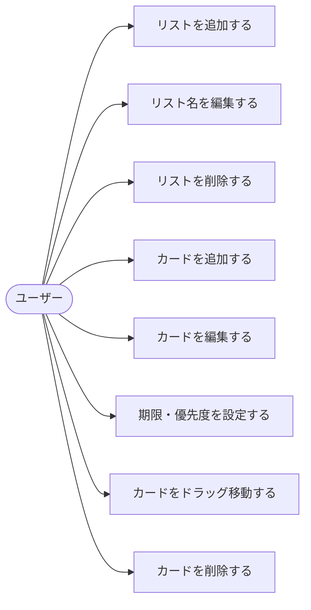
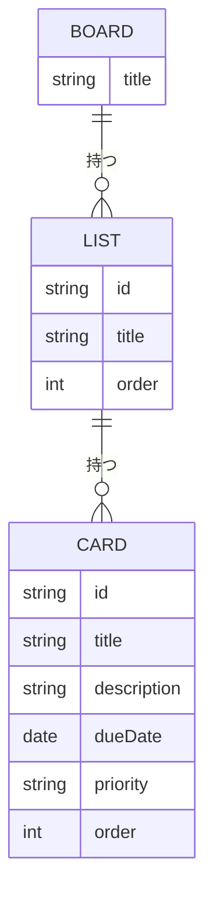
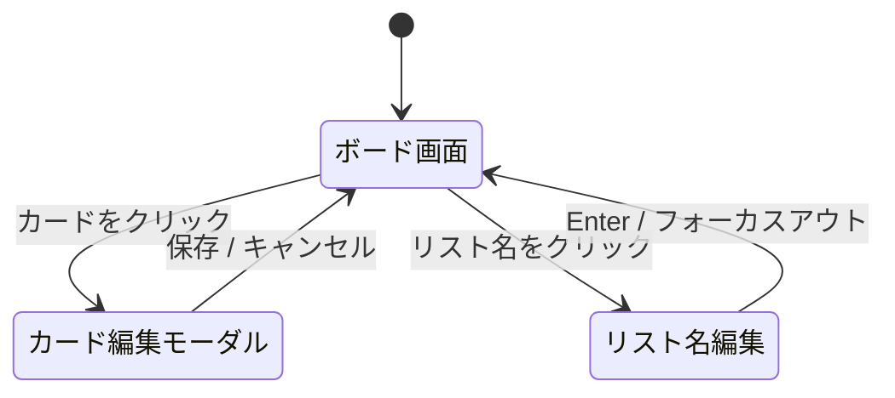

# 要件定義書：Trello風タスク管理アプリ

## 目次

1. [目的](#目的)
2. [アプリ概要](#アプリ概要)
3. [対象ユーザー](#対象ユーザー)
4. [機能要件](#機能要件)
5. [非機能要件](#非機能要件)
6. [画面構成](#画面構成)
7. [技術スタック](#技術スタック)
8. [対象外（今回は作らない）](#対象外今回は作らない)
9. [ユースケース図](#ユースケース図)
10. [E-R図（データ構造）](#er図データ構造)
11. [画面遷移図](#画面遷移図)
12. [用語集](#用語集)

---

## 目的

タスクの「見える化」によって、やるべきことの抜け漏れや優先度の混乱を防ぐことを目的とする。
ログイン不要・インストール不要でブラウザからすぐ使えるシンプルさを重視し、個人が日常のタスクをストレスなく管理できる環境を提供する。

---

## アプリ概要

ブラウザで動く、ログイン不要のタスク管理アプリ。
カードをリスト間でドラッグして移動でき、データはブラウザに自動保存される。

---

## 対象ユーザー

- 自分のタスクを視覚的に管理したい人
- ログイン不要でシンプルに使いたい人

---

## 機能要件

> 機能要件とは「アプリが何をできるか」を定めたもの。

### ボード機能

| # | 機能 | 内容 |
|---|------|------|
| 1 | リスト追加 | 「＋リストを追加」ボタンで列を増やせる |
| 2 | リスト削除 | リスト名の横の「×」で列を削除できる |
| 3 | リスト名編集 | リスト名をクリックして名前を変更できる |

### カード（タスク）機能

| # | 機能 | 内容 |
|---|------|------|
| 4 | カード追加 | 各リストに「＋カードを追加」ボタンがある |
| 5 | カード削除 | カードの「×」ボタンで削除できる |
| 6 | カード編集 | カードをクリックすると詳細を編集できる |
| 7 | 期限設定 | カードに締め切り日を設定できる |
| 8 | 優先度設定 | 高・中・低の3段階で設定できる |

### ドラッグ＆ドロップ

| # | 機能 | 内容 |
|---|------|------|
| 9 | カード移動 | カードをつかんで別のリストに移動できる |

### データ保存

| # | 機能 | 内容 |
|---|------|------|
| 10 | 自動保存 | ページを閉じてもデータが消えない（ブラウザのlocalStorageに保存） |

---

## 非機能要件

> 非機能要件とは「どのくらいの品質か」を定めたもの。

| # | 項目 | 内容 |
|---|------|------|
| 1 | 対応環境 | Chrome / Safari / Firefox（最新版） |
| 2 | レスポンシブ | スマホ・タブレット・PCどれでも見やすい |
| 3 | 表示速度 | ページ読み込みが3秒以内 |

---

## 画面構成

```
┌─────────────────────────────────────────────────┐
│  タスク管理アプリ                      ＋リスト追加 │
├──────────────┬──────────────┬────────────────────┤
│  やること     │  進行中      │  完了              │
├──────────────┼──────────────┼────────────────────┤
│ 📋 読書感想文  │ 📋 自由研究   │ 📋 日記            │
│ 期限: 8/31   │ 期限: 8/20   │                    │
│ 優先度: 高   │ 優先度: 中   │                    │
├──────────────┼──────────────┼────────────────────┤
│ ＋カード追加  │ ＋カード追加  │ ＋カード追加        │
└──────────────┴──────────────┴────────────────────┘
```

---

## 技術スタック

| 役割 | 使う技術 | 理由 |
|------|----------|------|
| 見た目・操作 | HTML / CSS / JavaScript | Web標準。初心者に最適 |
| ドラッグ＆ドロップ | SortableJS | 無料ライブラリで簡単に実装できる |
| データ保存 | localStorage | サーバー不要。ブラウザ内蔵の保存機能 |

---

## 対象外（今回は作らない）

- ログイン・アカウント機能
- 複数人でのボード共有
- ファイル添付
- 通知機能

---

## ユースケース図



---

## E-R図（データ構造）

> ログイン不要・localStorage保存のためDBは持たないが、データの関係性を示す。



---

## 画面遷移図

> シングルページアプリのため、モーダルの開閉が主な遷移となる。



---

## 用語集

| 用語 | 意味 |
|------|------|
| ボード | アプリ全体の作業スペース |
| リスト | 「やること」「完了」などの縦の列 |
| カード | 1つ1つのタスク（付箋） |
| localStorage | ブラウザ内蔵のデータ保存機能 |
| SortableJS | ドラッグ＆ドロップを簡単に実装できる無料ライブラリ |
