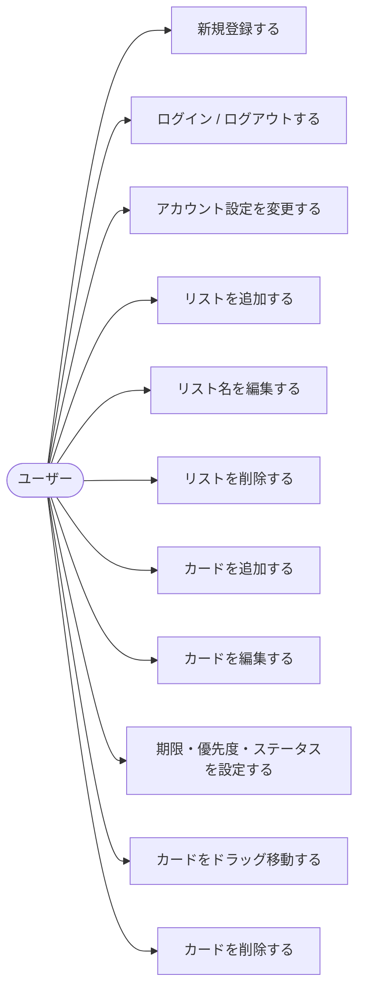
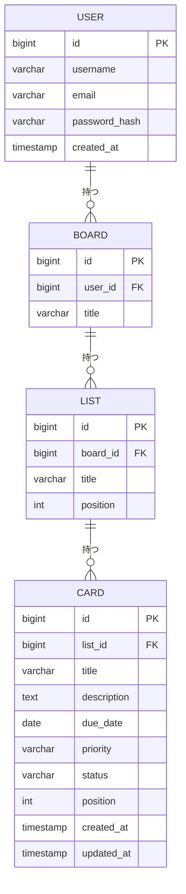
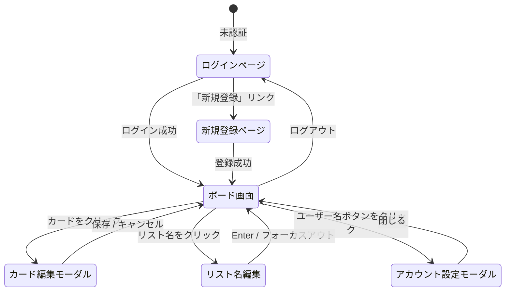

# 要件定義書：Trello風タスク管理アプリ

## 目次

1. [目的](#目的)
2. [アプリ概要](#アプリ概要)
3. [対象ユーザー](#対象ユーザー)
4. [機能要件](#機能要件)
5. [非機能要件](#非機能要件)
6. [画面構成](#画面構成)
7. [技術スタック](#技術スタック)
8. [対象外（今回は作らない）](#対象外今回は作らない)
9. [ユースケース図](#ユースケース図)
10. [E-R図（データ構造）](#e-r図データ構造)
11. [画面遷移図](#画面遷移図)
12. [用語集](#用語集)

---

## 目的

タスクの「見える化」によって、やるべきことの抜け漏れや優先度の混乱を防ぐことを目的とする。
ブラウザからすぐ使えるシンプルさを重視しつつ、アカウント管理によって自分のデータを安全に保存できる環境を提供する。

---

## アプリ概要

ブラウザで動く、アカウント登録制のタスク管理アプリ。
カードをリスト間でドラッグして移動でき、データはサーバー（PostgreSQL）に保存される。
ログイン後は自分のボードのみにアクセスできる。

---

## 対象ユーザー

- 自分のタスクを視覚的に管理したい人
- データを永続的・安全に保存したい人

---

## 機能要件

> 機能要件とは「アプリが何をできるか」を定めたもの。

### 認証機能

| # | 機能 | 内容 |
|---|------|------|
| 1 | 新規登録 | ユーザー名・メールアドレス・パスワードでアカウントを作成できる |
| 2 | ログイン | ユーザー名またはメールアドレス＋パスワードでログインできる |
| 3 | ログアウト | ヘッダーのボタンでログアウトできる |
| 4 | アカウント設定 | ユーザー名・メールアドレスの変更、パスワード変更ができる |

### ボード機能

| # | 機能 | 内容 |
|---|------|------|
| 5 | リスト追加 | 「＋ リスト追加」ボタンで列を増やせる |
| 6 | リスト削除 | リスト名の横の「×」で列を削除できる |
| 7 | リスト名編集 | リスト名をクリックして名前を変更できる |

### カード（タスク）機能

| # | 機能 | 内容 |
|---|------|------|
| 8  | カード追加 | 各リストに「＋カードを追加」ボタンがある |
| 9  | カード削除 | カードの「×」ボタンで削除できる |
| 10 | カード編集 | カードをクリックすると詳細を編集できる |
| 11 | 期限設定 | カードに締め切り日を設定できる（期限切れは赤くハイライト） |
| 12 | 優先度設定 | 高・中・低の3段階で設定できる |
| 13 | ステータス設定 | 未完了・進行中・完了の3段階で設定できる |
| 14 | 作成日・更新日表示 | カード編集モーダルに作成日・最終更新日を表示する |

### ドラッグ＆ドロップ

| # | 機能 | 内容 |
|---|------|------|
| 15 | カード移動 | カードをつかんで別のリストに移動できる |

### データ保存

| # | 機能 | 内容 |
|---|------|------|
| 16 | サーバー保存 | データはPostgreSQLに保存され、ログインすれば端末をまたいで参照できる |

---

## 非機能要件

> 非機能要件とは「どのくらいの品質か」を定めたもの。

| # | 項目 | 内容 |
|---|------|------|
| 1 | 対応環境 | Chrome / Safari / Firefox（最新版） |
| 2 | レスポンシブ | スマホ・タブレット・PCどれでも見やすい |
| 3 | 表示速度 | ページ読み込みが3秒以内 |
| 4 | セキュリティ | JWT認証・BCryptパスワードハッシュ・所有者チェックによりデータを保護 |

---

## 画面構成

```
┌─────────────────────────────────────────────────────────┐
│  📋 タスク管理アプリ   [ユーザー名] [ログアウト] [＋リスト追加] │
├──────────────┬──────────────┬──────────────────────────┤
│  やること     │  進行中      │  完了                    │
├──────────────┼──────────────┼──────────────────────────┤
│ 読書感想文    │ 自由研究     │ 日記                     │
│ [未完了]     │ [進行中]     │ [完了]                   │
│ 📅 8/31 [高] │ 📅 8/20 [中] │                          │
├──────────────┼──────────────┼──────────────────────────┤
│ ＋カード追加  │ ＋カード追加  │ ＋カード追加              │
└──────────────┴──────────────┴──────────────────────────┘
```

---

## 技術スタック

| 役割 | 使う技術 | 理由 |
|------|----------|------|
| フロントエンド | React 19 + Vite | コンポーネント指向で保守性が高い |
| ドラッグ＆ドロップ | @hello-pangea/dnd | React向けの標準的なDnDライブラリ |
| バックエンド | Spring Boot 3.4 + Java 21 | 型安全・実績あるWebフレームワーク |
| データベース | PostgreSQL 16 | 永続的なデータ保存 |
| 認証 | JWT（JSON Web Token）+ BCrypt | ステートレスな認証・安全なパスワード保存 |
| インフラ | Docker / docker-compose | DB環境を簡単に構築できる |

---

## 対象外（今回は作らない）

- 複数人でのボード共有
- ファイル添付
- 通知機能
- パスキー認証（将来実装予定）

---

## ユースケース図



---

## E-R図（データ構造）



---

## 画面遷移図

> シングルページアプリのため、モーダルの開閉や認証状態が主な遷移となる。



---

## 用語集

| 用語 | 意味 |
|------|------|
| ボード | アプリ全体の作業スペース（ユーザーごとに1つ自動作成） |
| リスト | 「やること」「完了」などの縦の列 |
| カード | 1つ1つのタスク（付箋） |
| JWT | JSON Web Token。ログイン状態を管理するトークン |
| BCrypt | パスワードを安全にハッシュ化するアルゴリズム |
| @hello-pangea/dnd | ドラッグ＆ドロップを実装するReactライブラリ |
